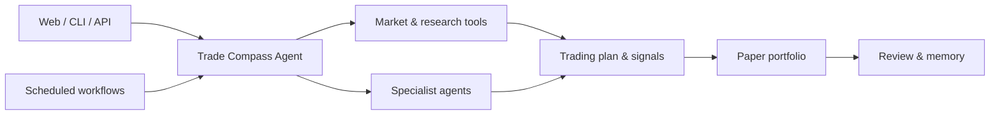

# Trade Compass Agent

[](https://www.python.org/)
[](https://fastapi.tiangolo.com/)
[](https://react.dev/)
[](LICENSE)

[English](README.md) | [简体中文](README.zh-CN.md)

**A local-first AI research workbench built for the A-share market.**

Trade Compass Agent combines market data, technical and fundamental analysis, specialist agents, paper portfolios, scheduled workflows, and long-term memory in one Web and CLI application. Use it to research stocks, build trading plans, track signals, review decisions, and turn your own research process into a repeatable workflow.

## Quick start

### Requirements

- Python 3.12+
- [uv](https://docs.astral.sh/uv/)
- Node.js 20 and pnpm 9+
- An API key for your LLM provider; DeepSeek is the default

### Install and run

From the repository root:

```bash
uv sync
pnpm install --frozen-lockfile
pnpm --dir apps/web build

cp .env.example .env
chmod 600 .env
```

Add your model API key to `.env`:

```dotenv
DEEPSEEK_API_KEY=your-deepseek-key
```

Start Trade Compass:

```bash
uv run trade-compass doctor
uv run trade-compass serve --open
```

Open `http://127.0.0.1:19704/agent` and start a conversation.

```text
Analyze 600519 using price action, fundamentals, recent disclosures,
and market context. Give me the key drivers, risks, and a trading plan.
```

## Features

### AI-powered market research

The agent can retrieve market data, calculate technical indicators, inspect fundamentals and company disclosures, search news and research sources, analyze fund flows, and combine the results into one response.

### Specialist agent team

Dispatch focused research to built-in specialists:

- **Intraday Technical** — short-horizon price structure and technical signals
- **Equity Research** — fundamentals, research, bull/bear debate, and PM synthesis
- **Macro Sentiment** — macro conditions, market sentiment, and fund flows
- **Screener** — AI review of quantitative screening candidates
- **Chokepoint Analyst** — supply-chain bottlenecks and critical upstream companies
- **Risk Advisor** — exposure, concentration, drawdown, and portfolio risk

### A-share market toolkit

- Daily and intraday bars with pluggable data providers
- Technical indicators including MA, MACD, RSI, Bollinger Bands, and ATR
- Market pulse, sector strength, fund flow, fundamentals, announcements, and news
- A-share lot sizes, T+0/T+1 rules, board-specific price limits, fees, and slippage
- AkShare and Baostock included; optional Tushare and CNInfo support

### Paper portfolio and signal tracking

Create multiple paper accounts, record simulated trades, analyze positions and P&L, check portfolio concentration, and evaluate signal follow-through after 1, 3, and 5 trading days.

### Automated research workflows

Run complete research workflows on demand or on a schedule:

- Premarket briefing and morning plan
- Stock screening and idea generation
- Intraday technical and equity research
- Catalyst calendar and close check
- End-of-day and weekly review

### Memory, rules, and review

Trade Compass stores sessions, research notes, user rules, decisions, and reviews locally. Memory search, reflection, contradiction detection, and decision reconciliation help carry useful context into future research.

### Web, CLI, API, and integrations

Use the React workbench, automate with the CLI, build on the FastAPI API, connect MCP tools, and deliver notifications through Feishu, WeCom, Weixin, or generic Webhooks.

## How it works



## Usage

### Web workbench

```bash
uv run trade-compass serve
```

The Web UI includes agent chat, session history, paper portfolios, memory, audit records, user rules, skills, scheduled jobs, and settings. The interactive API reference is available at `http://127.0.0.1:19704/docs`.

Start without scheduled background jobs:

```bash
uv run trade-compass serve --no-scheduler
```

### CLI

```bash
# Ask the agent
uv run trade-compass agent "How is the A-share market today?"

# Inspect market data
uv run trade-compass market-pulse
uv run trade-compass data-check 600519 510300

# Work with schedules, rules, and research history
uv run trade-compass scheduler list
uv run trade-compass rules list
uv run trade-compass audit recent --limit 20
uv run trade-compass evaluate --limit 100
```

Run `uv run trade-compass --help` to see all commands.

### Run as a local service

```bash
uv run trade-compass service install
uv run trade-compass service status
uv run trade-compass service verify
```

## Configuration

Application settings live in `config/default.yaml`; API keys and local overrides live in `.env`.

Supported LLM providers include DeepSeek, OpenAI, Anthropic, OpenRouter, DashScope, Ollama, and LM Studio. Optional extras add Tushare, MCP clients, messaging channels, chart rendering, forecasting, and enhanced search.

Example: enable Tushare data.

```bash
uv sync --extra tushare
```

```dotenv
TUSHARE_TOKEN=your-tushare-token
```

Then set `data.tushare_enabled: true` in `config/default.yaml`.

## Development

```bash
uv sync --extra dev
pnpm install --frozen-lockfile

uv run trade-compass serve --dev  # API on :19704
pnpm --dir apps/web dev            # Web UI on :3000
```

Run the project checks before opening a pull request:

```bash
scripts/ci_check.sh
pnpm --dir apps/web test
pnpm --dir apps/web typecheck
pnpm --dir apps/web build
git diff --check
```

See [CONTRIBUTING.md](CONTRIBUTING.md) for contribution guidelines and [CHANGELOG.md](CHANGELOG.md) for release history.

## License

[MIT](LICENSE)
