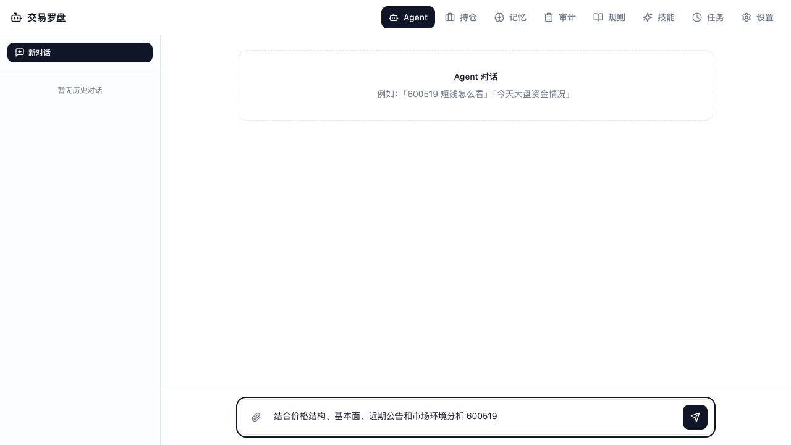
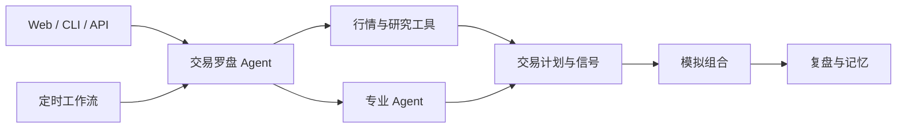

# Trade Compass Agent（交易罗盘）

[](https://www.python.org/)
[](https://fastapi.tiangolo.com/)
[](https://react.dev/)
[](LICENSE)
[](https://github.com/AdenChenCoder/trade-compass-agent/actions/workflows/ci.yml)

[简体中文](README.md) | [English](README.en.md)

**一个专为 A 股市场打造的本地优先 AI 投研工作台。**

Trade Compass Agent（交易罗盘）将行情数据、技术面与基本面分析、专业 Agent、模拟组合、自动化工作流和长期记忆整合在一个 Web 与 CLI 应用中。你可以用它研究股票、制定交易计划、跟踪信号、复盘决策，并将自己的投研方法沉淀为一套可重复执行的工作流。



## 快速开始

### 环境要求

- Python 3.12+ 和 [uv](https://docs.astral.sh/uv/)
- Node.js 22 和 pnpm 11.1.3
- 远程模型服务的 API Key，或本地运行的 Ollama / LM Studio

项目目前处于预发布阶段，尚未提供 PyPI 包或 GitHub Release。请先从源码运行：

```bash
git clone https://github.com/AdenChenCoder/trade-compass-agent.git
cd trade-compass-agent
uv sync
pnpm install --frozen-lockfile
pnpm --dir apps/web build
uv run trade-compass setup --wizard
uv run trade-compass doctor
uv run trade-compass serve --open
```

首次运行会创建本地配置并引导选择模型与数据源；后续可用
`uv run trade-compass configure` 调整。完整说明见
[快速上手](docs/getting-started.md)和[配置](docs/configuration.md)。

打开 `http://127.0.0.1:19704/agent`，即可开始对话。

```text
结合价格结构、基本面、近期公告和市场环境分析 600519，
给出核心驱动因素、主要风险和交易计划。
```

## 产品特性

### AI 驱动的市场研究

Agent 可以获取行情、计算技术指标、检查基本面与公司公告、搜索资讯和研究资料、分析资金流，并将不同来源的信息汇总为一份完整结论。

### 专业 Agent 团队

将不同研究任务交给内置的专业角色：

- **日内技术分析** — 短周期价格结构与技术信号
- **个股研究** — 基本面、研究资料、多空辩论与投资经理综合判断
- **宏观情绪** — 宏观环境、市场情绪与资金流
- **智能筛选** — 对量化筛选候选进行 AI 复核
- **产业链卡点分析** — 识别供应链瓶颈与关键上游公司
- **组合风控** — 分析敞口、集中度、回撤与组合风险

### A 股市场工具箱

- 日线与分钟线行情，并支持可替换的数据源
- MA、MACD、RSI、布林带、ATR 等技术指标
- 市场脉搏、板块强度、资金流、基本面、公司公告和资讯
- A 股交易单位、T+0/T+1、不同板块涨跌停、费用与滑点
- 内置 AkShare 与 Baostock，可选接入 Tushare 和巨潮资讯

### 模拟组合与信号跟踪

创建多个模拟账户，记录模拟交易，分析持仓和盈亏，检查组合集中度，并在 1、3、5 个交易日后评估信号表现。

### 自动化研究工作流

按需运行或定时执行完整投研流程：

- 盘前简报与早盘计划
- 股票筛选与想法生成
- 日内技术与个股研究
- 催化日历与收盘检查
- 日终复盘与周度复盘

### 可扩展 Skills

内置 Skills 提供催化日历、想法生成、日内技术和投资大师方法等研究能力。
你也可以添加自己的 Skill，将个人投研流程和输出规范交给 Agent 重复执行。

### 记忆、规则与复盘

交易罗盘会在本地保存会话、研究笔记、用户规则、历史决策和复盘记录。记忆搜索、反思、矛盾检测和决策调和可以将有效上下文带入后续研究。

### Web、CLI、API 与外部集成

通过 React 工作台交互，使用 CLI 自动化任务，基于 FastAPI API 扩展应用，连接 MCP 工具，并通过飞书、企业微信、微信或通用 Webhook 接收通知。

## 工作方式



## 使用方式

### Web 工作台

```bash
uv run trade-compass serve
```

Web UI 集中提供 Agent 对话、历史会话、模拟组合、记忆、审计记录、用户规则、Skills、定时任务和设置。交互式 API 文档位于 `http://127.0.0.1:19704/docs`。

不启动后台定时任务：

```bash
uv run trade-compass serve --no-scheduler
```

### CLI

```bash
# 向 Agent 提问
uv run trade-compass agent "今天 A 股市场怎么样？"

# 检查市场数据
uv run trade-compass market-pulse
uv run trade-compass data check 600519 510300

# 查看定时任务、规则和研究记录
uv run trade-compass jobs list
uv run trade-compass rules list
uv run trade-compass audit recent --limit 20
uv run trade-compass evaluate --limit 100
```

运行 `uv run trade-compass --help` 可以查看全部命令。

### 作为本地服务运行

```bash
uv run trade-compass service install
uv run trade-compass service status
uv run trade-compass service verify
```

## 配置

日常设置通过配置向导管理，无需手动修改配置文件：

```bash
uv run trade-compass configure
```

源码工作区使用 `config/default.yaml` 和仓库根目录的 `.env`；密钥不应
写入配置文件或提交到 Git。安装版会将设置和密钥保存在
`~/.trade-compass/` 下。

支持的 LLM 提供商包括 DeepSeek、OpenAI、Anthropic、OpenRouter、DashScope、Ollama 和 LM Studio。默认依赖已包含股票分析所需的图表渲染能力；可选依赖还可以增加 Tushare、MCP 客户端、消息通道、行情预测和增强搜索能力。

例如，启用 Tushare 数据：

```bash
uv sync --extra tushare
```

再次运行 `uv run trade-compass configure`，选择自动或 Tushare 数据源
并填写 Token。

## 文档导航

| 目标 | 文档 |
| --- | --- |
| 安装并完成首次运行 | [快速上手](docs/getting-started.md) |
| 配置模型、存储、数据源和可选功能 | [配置](docs/configuration.md) |
| 使用和自动化命令行 | [CLI 参考](docs/cli.md) |
| 创建并打包运行时 Skills | [Skills](docs/skills.md) |
| 理解仓库和状态边界 | [架构](docs/architecture.md) |
| 了解本地数据与外部服务边界 | [隐私](PRIVACY.md) / [威胁模型](docs/threat-model.md) |
| 构建、验证和发布版本 | [发布](docs/releasing.md) |

## 开发与贡献

```bash
uv sync --extra dev
pnpm install --frozen-lockfile

uv run trade-compass serve --dev  # API: :19704
pnpm --dir apps/web dev            # Web UI: :3000
```

提交 Pull Request 前运行：

```bash
scripts/ci_check.sh
pnpm --dir apps/web test
pnpm --dir apps/web typecheck
pnpm --dir apps/web build
git diff --check
```

## 社区

- 提议较大改动前请阅读 [CONTRIBUTING.md](CONTRIBUTING.md)。
- 通过 [SUPPORT.md](SUPPORT.md) 选择正确的支持入口。
- 安全漏洞按 [SECURITY.md](SECURITY.md) 私下报告，不要创建公开 Issue。
- 数据流和保留边界见 [PRIVACY.md](PRIVACY.md)。
- 社区参与遵循 [CODE_OF_CONDUCT.md](CODE_OF_CONDUCT.md)。
- 版本记录维护在 [CHANGELOG.md](CHANGELOG.md)。

## 许可证

[MIT](LICENSE)
