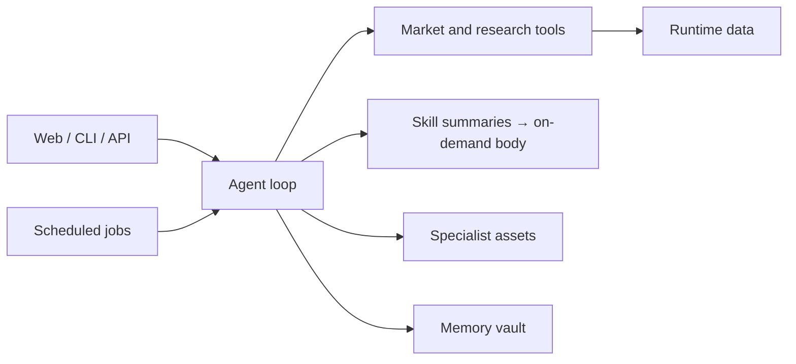

# Architecture

Trade Compass is a local-first application with Web, CLI, API, and scheduled
workflow surfaces over the same Python runtime.

## Repository map

| Path | Responsibility |
| --- | --- |
| `src/trade_compass_agent/runtime/` | Agent loop, context, tools, Skills, specialists |
| `src/trade_compass_agent/web/` | FastAPI application and HTTP contracts |
| `apps/web/` | React workbench source |
| `.trade-compass/skills/` | Built-in Skill source |
| `src/trade_compass_agent/workflows/` | Packaged workflow assets |
| `config/` | Source and installed-package defaults |
| `schemas/` | Input/output validation contracts |
| `tests/` | Consumer and component verification |
| `scripts/` | CI, build, security, and release checks |

## State ownership

- Package files and built-in assets are read-only after installation.
- `data_dir` owns operational records, caches, runs, and audit data.
- `memory_dir` owns durable knowledge, rules, and runtime-created Skills.
- Backups and exports are recovery artifacts, not replacements for live state.

## Extension boundaries

- Add reusable workflow guidance as a Skill.
- Add deterministic data access or calculation as a runtime tool.
- Add a focused reasoning role as a specialist asset.
- Add a repeatable multi-step scheduled product flow as a workflow.
- Add Web presentation behavior under `apps/web/` without duplicating backend
  business rules.
