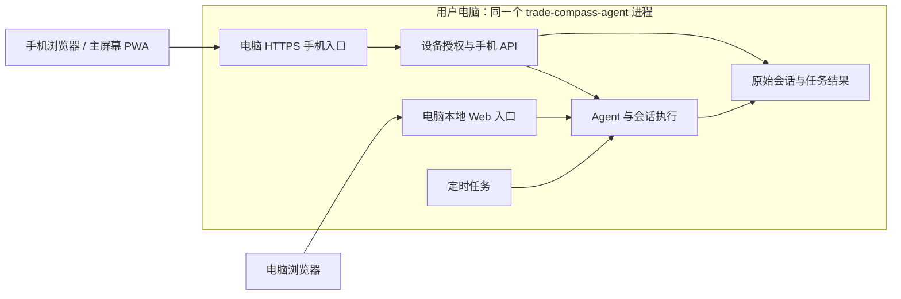

# 电脑作为服务端，浏览器与手机作为客户端

用户目标：启动 trade-compass-agent 后，电脑浏览器和授权手机使用同一个 Agent、同一份会话历史和任务结果。手机页面随项目分发，由用户电脑提供。无需 APK、IPA、应用商店或 GPT 页面托管。

**2026-09-14 当前入口**：开发分支已集成 Tailscale Funnel 连接组件、项目设置页授权步骤和随主程序启停的生命周期。普通用户操作见 [手机连接](mobile-managed-connection.md)，测试结果与未验证范围见 [安全审查记录](mobile-managed-access-review.md)。本页保留早期架构推导与开发证书验证背景，不应将旧开发操作当作安装步骤。

## 正式交付约束（2026-09-12 修订）

这是面向其他用户的开源产品，不能把当前测试者的网络配置当作安装流程。普通用户只需在电脑开启手机连接、手机扫码、电脑确认；添加到主屏幕和通知授权使用系统提供的交互。地址分配、证书签发与续期、连接恢复应由产品处理。

2026-09-11 用户进一步明确：免注册是优先目标，不是阻塞条件。必要时可以引导用户首次注册一个外部服务账号，再回填少量必要信息，尽可能简单。优先使用浏览器登录授权，无法实现时才采用凭据回填；普通断网和电脑重启应复用授权，权限到期或被撤销时才要求重新授权。账号注册与初始授权的让步不包含手工运维、付费购买、批量代注册或把凭据交给对话助手。

2026-09-12 当前选型收敛为安全优先的托管接入，最终只保留一至两种通过验证的方案。局域网 / 公网 IP 直连、自动端口映射、自带服务器、自部署中继和项目自营接入节点均退出本次选型；已有开发代码与用户历史保留。候选审查和实际验收以 [托管接入安全记录](mobile-managed-access-review.md) 为准，下面的开发流程不代表正式交付方向。

不要求普通用户提供路由器型号、登录路由器、映射端口、购买域名、编辑配置、手动信任开发 CA，或另装 VPN / 隧道客户端。下面的 IP 和开发证书流程只供开发验收。不得将这些测试步骤包装成正式交付。

允许研究由用户自己的账号使用托管连接服务，但当前仍未批准或部署产品自营的域名分配、证书协调、信令或中继服务。供应商服务器仍然是外部基础设施，不能用“无业务云中心”掩盖这一事实。供应商选择、免费条件、信息可见范围与实际首次流程应一起评估。

失败反例：开发者的 IPv6 网络能够连接，其他用户却要调整路由器或安装证书。后续产品验收必须使用全新安装、默认路由器配置，分别覆盖首次安装、扫码批准、手机切换网络、电脑重启、通知回到任务结果和设备撤销。保留原始会话、草稿、任务投递规则和源码 / wheel 一致性。

## 架构与使用过程



两个入口可以使用不同端口，但共用运行进程、Agent 执行逻辑和数据。电脑的配置、规则、管理接口仍只允许本机访问；手机入口仅提供批准后可用的会话、发送消息和任务消息接口。不能直接把整个桌面管理服务暴露到局域网。

预期使用过程：

1. 电脑启动项目，在“设置 → 连接手机”开启连接。
2. 首次按页面提示登录 Tailscale 并授予 HTTPS / Funnel 权限；电脑准备手机可访问的 HTTPS 地址，页面与 API 均来自这台电脑。
3. 手机扫描配对二维码，申请连接；输入电脑显示的六位配对码后自动完成验证。
4. 手机打开电脑已有的会话并发送，Agent 在电脑执行，结果写入原来的会话。
5. 断网后恢复连接，继续使用已有授权；电脑移除设备后，该手机立即失去访问权限。

手机不运行另一套 Agent。会话由电脑原始记录提供，手机缓存仅供离线阅读。请求超时不会自动重新执行；沿用持久请求 ID 查询原执行状态。电脑重启导致执行结果不确定时，提示用户核对，不自动重复工具操作。

## 这轮已经落实的入口

- 标准手机构建默认使用同源 HTTPS 请求，不再因为路径是 `/mobile/` 就切换到手动 WebRTC。
- HTTPS 手机服务提供 `/mobile/` 页面及 `/mobile/v1/...` 接口；桌面设置在连接就绪后提供配对二维码。
- 原来的 `/phone/` 保留，已有安装入口和授权 Cookie 仍可使用。
- 桌面本机 `/mobile/` 在未配置 HTTPS 时仅供预览；界面明确说明其不能作为可用的手机连接地址。
- WebRTC 代码与单独的 `build:peer` 开发产物保留，已从普通用户设置页移除，不能拿它的返回信息填写标准移动端。
- 页面包含在源码构建和 Python wheel 中；不需要外部页面托管。

现有前台同步使用轮询。后续若改用 SSE 或 WebSocket，只更换更新通知方式，原始会话、请求去重和补取机制保持不变。第一版不需要先引入新协议才能共享会话。

## 早期局域网验证记录：没有域名时的开发测试

可以先在同一 Wi-Fi 下，用电脑的局域网 IP 做真机开发验证。网页需要通过手机信任的 HTTPS 打开，才能验证 Service Worker、离线能力和系统推送；手机访问电脑 IP 不等同于访问手机自己的 localhost。[MDN：Service Worker](https://developer.mozilla.org/en-US/docs/Web/API/Service_Worker_API/Using_Service_Workers)

项目现在提供生成工具。它只生成文件，不安装系统信任，不修改现有配置，不启动服务。选择一个全新的输出目录：

```bash
# 源码版本
uv run python -m trade_compass_agent.mobile.setup --address 192.168.1.17 --output ~/trade-compass-pwa-test
# 安装 wheel 后，在安装环境使用同一个模块
python -m trade_compass_agent.mobile.setup --address 192.168.1.17 --output ~/trade-compass-pwa-test
```

上面两条是不同环境下的替代用法，不需要依次执行。地址必须替换成电脑实际的局域网 IP。工具拒绝覆盖已有目录。产物包括手机可导入的公开 `public-ca.cer`、电脑专用 `server-key.pem` 与证书链、`mobile-fragment.yaml` 和逐步说明。根证书私钥不保存，证书有效期为 30 天；结束测试应从手机移除测试证书。

无域名的开发路径如下，尚未自动配置到用户设备：

1. 在电脑生成专用开发 CA，并为电脑的局域网 IP 签发包含该 IP SAN 的服务器证书。私钥只留在电脑。
2. 在测试手机安装该开发 CA 的公开证书。iPhone 手动安装后，还需在“设置 → 通用 → 关于本机 → 证书信任设置”开启对应根证书的完全信任。这是测试证书设置，不是安装 iOS 应用。[Apple：手动证书信任](https://support.apple.com/en-ca/102390)
3. 将生成的 `mobile-fragment.yaml` 字段合并到原配置的 `mobile` 项，保留其他配置。它仅是片段，不能替换完整配置或单独用作 `TRADE_COMPASS_CONFIG`。其中 `mobile.public_origin` 是 `https://电脑局域网IP:19705`，证书中的 IP 必须匹配。
4. 运行项目、开启手机连接，确认手机浏览器没有证书警告，再扫码配对和添加到主屏幕。
5. 检查 Wi-Fi 是否隔离设备及电脑防火墙是否允许该入口。电脑 IP 改变后，需要更新访问地址与证书；已有站点的安装地址不会自动跟随变化。

这是开发测试路径，不适合让所有普通用户长期手动信任根证书。未授权前不修改系统信任、不安装根证书，不把私钥提供给手机。

普通用户入口现由内置 Funnel 组件准备域名与证书，上述手动证书步骤只保留供开发复现。DNS-01 可以为域名签发受信任证书，但本身不解决网络可达性。证书私钥由各电脑单独生成与保管，不能随开源安装包分发共享私钥。[Let's Encrypt：DNS-01](https://letsencrypt.org/docs/challenge-types/)

## 手机不在同一网络时

局域网 IP 通常只能在当前局域网使用。手机切换到蜂窝网络后，还需要一条能到达电脑的网络路径。手工配置公网入口或 VPN 是个别开发环境的办法，不满足上述正式交付约束。

在没有可达地址或转发通道的前提下，不能承诺任意家庭网络中的电脑都能被外面的手机直接连接。WebRTC 可尝试建立直连，但一些网络需要 TURN 转发；仅增加 STUN 或把配置藏进 UI 不能解决全部情况。系统推送也不能替代浏览器到电脑的双向连接。[WebRTC：TURN](https://webrtc.org/getting-started/turn-server)

**候选机制：内置托管连接 + 稳定 HTTPS 入口。** 电脑在用户开启连接后主动连接供应商公网节点，手机扫码打开该电脑的稳定域名；节点将连接转发回电脑，PWA 页面和业务 API 继续由电脑提供。关闭手机访问时关闭通道。只允许转发手机专用入口，不能转发桌面管理端口。以手机到电脑的 TLS 透传为目标，不把“电脑到中继的链路加密”误称为全程业务加密；证书签发和域名控制仍有相应信任边界。frp 自营或用户自建节点已退出本次选型。

这一方案确实引入公网基础设施和运营成本，包括域名、证书自动化、接入认证、带宽、滥用防护和地区可用性。接入服务至少接触连接地址、流量和设备路由元数据；业务正文、Agent 执行和原始历史仍应留在电脑。不能承诺无成本、零元数据或任意网络可达。若用户的约束是除系统推送外完全没有外部服务，则该候选不符合约束，不能直接实施。

当前托管模式已由 `mobile/managed.py` 实现，组件只转发到实际 HTTPS 的 loopback 移动端监听器；显式 `tls_relay` 模式允许公开 443 与本机端口不同，仍检查域名、有效期与私钥。停止、重开、原 Cookie 和历史保留已通过当前测试实例的真实接口验证。实验 `mobile/peer.py` 仍是独立开发机制，不能代替托管模式的实际网络验收。

### 接受首次账号授权后的验证方向

首选验证 Tailscale Funnel + 内置连接组件。Funnel 提供 `ts.net` HTTPS 入口，访问者无需安装 Tailscale，中继透传加密流量，TLS 在用户电脑终止。它目前仍标注 Beta，存在带宽限制，不能据此承诺国内外可用性或所有产品用途永久免费。[Funnel 文档](https://tailscale.com/docs/features/tailscale-funnel)

`tsnet` 可以嵌入 Go 程序，不要求单独运行系统级 Tailscale 守护进程；本项目是 Python 包，需要额外验证内置组件的跨平台打包、进程管理和源码 / wheel 一致性。`tsnet` 支持交互登录 URL 或 Auth Key，并持久化设备状态以供重启复用。Auth Key 只解决设备加入，不能假定它同时授予 Funnel 和 HTTPS 权限。[tsnet API](https://pkg.go.dev/tailscale.com/tsnet)、[登录与持久化](https://tailscale.com/docs/features/tsnet/how-to/create-basic-tsnet-app)

已实现的用户流程：

1. 在电脑“连接手机”点击开启外网访问，程序显示服务商、账号需求和连接状态。
2. 点击登录，在供应商页面注册或授权；需要启用 HTTPS / Funnel 时展示对应确认入口。优先免手工复制凭据。
3. 等待程序返回连接状态。当前只实现浏览器授权，没有凭据回填或手动编辑策略的兜底入口；无法完成时应保留失败证据。
4. 程序完成检查并取得可复用的 HTTPS 地址后展示配对二维码；手机扫码，再输入电脑显示的配对码。稳定来源是验收条件，不能靠每次重启更换随机域名完成连接。
5. 程序管理后台连接和重连；关闭手机访问时停止通道。供应商权限到期 / 撤销时显示重新授权入口，不能删除原始会话或自动重发 Agent 请求。

上述流程已有项目界面、模拟首次授权测试，并成功复用真实账号状态恢复原公网入口；全新账号通过该界面的端到端真机验证仍未完成。浏览器登录、HTTPS 和 Funnel 启用不能合并为“一次授权必定全部完成”。若最终还需要用户自行执行命令或编辑供应商策略，则此候选尚不满足简单交付要求。

ngrok 只审查中继不解密的端到端 TLS 模式；其免费版和 Hobbyist 不提供此能力，且本地 TLS 终止需要自行管理证书，因此暂不实施。不能将普通免费 HTTP 隧道作为安全等价替代，也无需用户提供免费账号 Token。任何候选均需实测国内网络，不用官方功能列表代替真机验收。[ngrok 套餐限制](https://ngrok.com/docs/pricing-limits/how-ngrok-charges)、[TLS 证书责任](https://ngrok.com/docs/gateway/endpoints/tls)

## 定时任务与系统通知

现有任务结果由电脑产生并持久化，手机打开页面后可读取。2026-09-10 已增加单独开启的自动任务提醒、持久队列和有限重试，见 [自动任务提醒](mobile-task-push.md)。用户已确认局域网及后续公网 PWA 的受控任务通知和点击直接进入“任务消息”；尚未覆盖全部平台与网络，也没有以真实交易任务作为通知验收样本。

实现路径：电脑任务完成 → 保存原始消息 → 后台补扫并持久化待推送记录 → 发送给浏览器/系统推送服务 → 手机显示提醒。用户点击后，手机连接电脑取得原始任务消息。推送只带通用提醒，不携带完整研究内容或凭据。

iPhone 从 iOS 16.4 起支持主屏幕 Web App 的 Web Push，并需要用户主动授权；无需应用商店。[WebKit：iOS Web Push](https://webkit.org/blog/13878/web-push-for-web-apps-on-ios-and-ipados/)

系统通知与手机能否连接电脑是两回事：即使系统提醒到达，电脑离线或外网不通时，也不能读取新的完整结果。不同 Android 浏览器和国内网络的后台通知能力需要真机验证，不能仅依据 Push API 存在就承诺可靠到达。

launchd 等机制可以管理电脑进程；它不等于电脑睡眠后仍可持续执行任务。电脑关机、睡眠或离线时，新任务和同步不能按在线状态承诺。应保留任务结果、待投递记录与恢复后的状态，而不是展示虚假的在线状态。

## 验收顺序与当前边界

1. 浏览器集成：从桌面入口配对，手机继续同一会话；断网恢复无需再次批准；移除设备后拒绝访问。必须检查真实接口与原始记录，不能只测页面渲染。
2. 安装包：在仓库外安装 wheel，验证相同入口、API 与只读资源，避免只在源码下成功。
3. 真机跨网：iPhone、国内和国际 Android 的浏览器分别验证默认网络下的授权、二维码、会话、重连与撤销；不要求开发 CA 或路由器配置。
4. 主屏幕与通知：实际添加到主屏幕，授权通知，关闭页面及锁屏后测试；浏览器注入的模拟推送不算真机通过。
5. 长期验收：供应商真实证书续期、断网与电脑进程恢复、完整首次安装和不同网络下持续运行。

独立测试实例已从开发证书入口迁移到 Funnel 公网 PWA，用户确认公网聊天、受控任务通知和点击定位正常；随后又复用同一域名和身份迁入项目托管生命周期。正式服务及真实任务未迁移。旧 `/phone/` 和实验代码保留；关闭手机访问会停止远程入口。多平台覆盖、全新账号完整首次流程及长期真实网络运行仍待验收。
