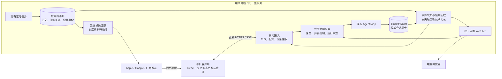

> 2026-09-09 更新：用户明确要求 PWA 优先；原生包不作为默认交付方式。当前实现与未解决的可信入口条件见 [PWA 验证说明](mobile-pwa-validation.md)。以下保留最初的调研及候选方案，不代表所有机制已采用。

**Trade Compass 移动端直连：GitHub 调研与实施方案**

调研日期：2026-09-08。项目基线：`7e8a473be5be1ff5d748bce3f914707df8cbfcec`。状态：方案，未实施。

建议采用“电脑内置移动接入服务 + 手机客户端 + 共享会话与通知存储”，允许使用设备系统提供的服务管理与推送机制。手机直连电脑，不部署产品自己的云端服务中心，不默认连接第三方业务发现或中转服务。APNs、FCM、厂商推送和标准 Web Push 属于允许研究的系统投递基础设施。主要借鉴 HAPI 的同步协议、LocalSend 的直连与证书校验、Syncthing 的设备身份授权；不整体引入这些项目。

约束修订：用户所说的“两端”指产品参与方为用户电脑和授权手机，不意味着禁止系统云推送。下文已据此修订；原生应用的推送凭据管理与 Web Push 的设备覆盖仍需验证，不能假定允许系统推送就已经解决全部接入问题。

**1. 目标、约束和第一版范围**

用户实际目标：手机能查看电脑端相同的 session 历史，在同一个 session 中继续与同一个 Agent 交互，查看定时任务发来的消息。

现有症状：微信、飞书渠道的登录和连接受外部平台控制，消息呈现与操作形式难以按产品定制。

建议实现机制：电脑上的既有服务增加经过设备授权的移动接口；桌面与手机共同调用会话业务服务，手机保存可重建的显示缓存。手机不启动自己的 Agent，不创建按手机身份分裂的会话。

第一版手机只有三个入口：

| 入口 | 能做什么 |
| --- | --- |
| 会话 | 会话列表、分页历史、打开现有 session、创建新会话、文本发送、接收流式结果、显式停止本轮 |
| 任务消息 | 最近任务通知、查看结果正文、来源任务与执行时间、成功或失败状态 |
| 连接 | 扫码绑定电脑、查看状态、更新地址、解绑 |

历史里的既有分析分节、Markdown 和工具摘要需要能正常显示。第一版不增加移动附件上传、交易确认工作流、规则编辑、文件管理、远程终端，也不增加聊天消息离线自动发送队列。

保留的契约：

- 用户电脑上的会话记录是权威历史；模型上下文、实时缓冲与手机缓存都不能替代它。
- 使用相同 `session_id`，沿用同一电脑的 Agent 配置、规则、记忆和工具权限；设备授权不会绕过业务权限。
- 定时任务继续使用隔离的内部会话，保持现有触发、交易日、静默成功与投递选择语义。
- 手机离线不阻止任务完成、结果落盘；电脑服务停止时手机明确显示离线。
- 源码和安装 wheel 保持同样的电脑端能力，新增状态写入配置的数据根，包内资源保持只读。
- 已存历史不为适配手机而删除、压缩或移动出正常可访问的用户界面。

第一版“收到消息”的目标：前台连接可用时实时展示；具备已验证系统推送能力的设备在后台收到提醒；断线、系统挂起或电脑重启后补齐仍在保留范围内的记录。系统推送受通知权限、系统策略与网络影响，不能承诺每条即时到达；未支持的设备明确提示并保留应用内补取。系统推送不解决任意 NAT 环境下手机到电脑的外网连接。

反例：连接成功但新建了 `mobile-xxx` 会话；只显示最后 200 个 SSE 事件作为历史；桌面切换会话中断手机正在看的任务；定时任务通知链接在内部 session 清理后失效。验收必须排除这些情况。

**2. GitHub 高星项目筛选结果**

筛选条件：本次 GitHub API 查询至少 5,000 stars；仓库未归档；近期仍有代码活动；公开文档或实现中能定位到对应机制。Stars 只是社区关注度，不能证明安全性或对本项目的适用性。以下数字为本次查询快照，并非长期固定值。

| 项目 | Stars | 仓库声明的许可证 | 适合借鉴 | 与本项目的差异 |
| --- | ---: | --- | --- | --- |
| [HAPI](https://github.com/tiann/hapi) | 5,004 | AGPL-3.0 | 同会话访问、REST + SSE、回放缺口与历史补齐 | 本地 Hub 可用，但推荐快速启动使用 relay；原生客户端仍标注开发中 |
| [Claude Code UI / CloudCLI](https://github.com/siteboon/claudecodeui) | 13,614 | AGPL-3.0 | 响应式聊天、运行任务与连接分离、跨端恢复 | 有自托管模式，也提供云产品；其编码代理包装与 provider ID 映射不是本项目所需 |
| [Happy](https://github.com/slopus/happy) | 23,696 | MIT | 手机会话体验、发送状态、客户端同步 | 包含独立同步服务器；端到端加密不等于无服务器 |
| [LocalSend](https://github.com/localsend/localsend) | 90,352 | Apache-2.0 | 无外部服务直连、局域网发现、证书指纹校验 | 传文件的会话不是 Agent 会话，不能照搬其传输 session |
| [Syncthing](https://github.com/syncthing/syncthing) | 88,394 | MPL-2.0 | 设备身份与地址分离、受信设备列表、TLS | 默认启用全局发现和 relay；文件多端同步模型不适合作为聊天业务存储 |
| [ntfy](https://github.com/binwiederhier/ntfy) | 34,096 | Apache-2.0 / GPLv2 双许可 | 通知持久化、订阅、离线补取与后台唤醒分离 | 常规 iOS 自托管路径还经过 ntfy 上游；系统推送允许，但该额外产品服务器不能默认引入 |

源码快照：HAPI `00a1d24`；Claude Code UI `5e73a49`；Happy `ac64b9b`；LocalSend `6279d3e`；Syncthing `2ca95cf`；ntfy `10cb650`。这六个仓库本次 API 返回的最近推送日期均在 2026-08-31 至 2026-09-08 之间。只核对了相关文档与选定源文件，没有安装运行或完成安全审计。

当前项目为 MIT。这里借鉴协议设计与可观察行为，不计划复制 AGPL 项目的实现，也不以高星作为直接引入依赖的理由。

**3. 具体借鉴点与语义映射**

HAPI 是同步协议的首要参考。其客户端通过 REST 获取记录，通过 SSE 接收变化；重连握手明确区分可完整回放与存在缺口，缺口触发权威状态重读。源码还将握手、回放和期间积累的实时事件按顺序发送。[协议](https://github.com/tiann/hapi/blob/00a1d24fd090f033f1fb2fb18ae411b9e001bf54/docs/api/client-contract/sse.md)、[事件路由源码](https://github.com/tiann/hapi/blob/00a1d24fd090f033f1fb2fb18ae411b9e001bf54/hub/src/web/routes/events.ts)

映射到这里：Hub 对应电脑已有 Python 服务；会话记录对应 `SessionStore`；实时变化对应新的共享事件发布层。采用缺口检测和重读机制，不复制 HAPI 的命名空间、多代理 RPC、排队消息重新排序和多机管理。我们的第一版不排队发送，因此没有必要采用它为排队消息设计的复合时间游标。[分页协议及其排队语义](https://github.com/tiann/hapi/blob/00a1d24fd090f033f1fb2fb18ae411b9e001bf54/docs/api/client-contract/pagination.md)

HAPI 的配对文档使用长期共享 access token 再换取短期 JWT；这不直接等同于本产品要求的逐设备授权。这里改为短期一次性配对凭证 + 电脑确认 + 每台手机独立可撤销凭据，不把长期管理密钥放进二维码。[HAPI 配对协议](https://github.com/tiann/hapi/blob/00a1d24fd090f033f1fb2fb18ae411b9e001bf54/docs/api/client-contract/auth.md)

Claude Code UI 将运行中的任务放入独立 registry，向订阅连接分发结果，恢复时结合历史与事件。但其自身架构文档也指出部分情况下已打开另一客户端不会收到新 run 的完整实时帧，且 run 内 seq 与客户端 session 级游标存在边界。这里学习“执行属于会话、连接只是观察者”，不复制这套具体订阅行为；两个已打开同 session 的客户端必须都能看到下一轮开始。[运行 registry](https://github.com/siteboon/claudecodeui/blob/5e73a49b89b4f13766fc2e22723297a36e7dcef2/server/modules/websocket/services/chat-run-registry.service.ts)、[会话与跨端行为文档](https://github.com/siteboon/claudecodeui/blob/5e73a49b89b4f13766fc2e22723297a36e7dcef2/docs/architecture/03-conversation-handoff.md)

Happy 适合参考移动端的会话列表、发送状态与同步体验，其实现包含服务端和移动同步代码。我们不需要增加 Happy Server、包装另一个 coding CLI 或在手机接入时重启 Agent 会话。[后端结构](https://github.com/slopus/happy/blob/ac64b9b4677870f7b7a9eacfd0780959229717f1/docs/backend-architecture.md)、[客户端同步代码](https://github.com/slopus/happy/blob/ac64b9b4677870f7b7a9eacfd0780959229717f1/packages/happy-app/sources/sync/sync.ts)

LocalSend 的协议明确不依赖外部服务器；当前 HTTP 客户端源码区分用于发现的连接与绑定指定证书指纹的连接，并要求业务数据使用后者。这里借鉴“先通过可信配对认识电脑，再严格验证它”，第一版直接扫描地址，不必实现全网段发现。[直连协议](https://github.com/localsend/protocol)、[指纹校验入口](https://github.com/localsend/localsend/blob/6279d3e30d1d1290caee3b81549f8128a8b01d9f/app/lib/provider/http_provider.dart)

Syncthing 的设备身份来自证书，连接时与允许的设备列表核对；全局发现和中转则是独立功能且默认开启。这里只采用持久设备身份、授权列表与撤销方式，不运行 Syncthing，也不双向同步正在写入的 JSONL 或 SQLite 文件。[安全与发现说明](https://docs.syncthing.net/users/security.html)

ntfy 展示了“通知先保存，订阅者再按位置补取”的实用设计，也记录了后台唤醒与正文读取分开的路径。我们采用补取思路，将任务正文留在电脑，允许系统推送提醒；不要求用户安装 ntfy，不默认引入 ntfy.sh 作为第三方产品中转。[缓存与补取](https://docs.ntfy.sh/config/#message-cache)、[iOS 接收路径](https://docs.ntfy.sh/config/#ios-instant-notifications)

**4. 当前项目的端到端证据**

| 链路 | 当前实现 | 方案中的处理 |
| --- | --- | --- |
| 用户发消息 | Web `/agent/turn` 调用 `AgentLoop.run_turn` | 抽出共享提交与执行服务，手机和桌面调用同一入口 |
| 用户历史 | `SessionStore` 在数据根下保存 JSONL；模型上下文另外存放 | 保留现有权威记录；手机读取用户可见历史，不能误用精简后的模型上下文 |
| 实时输出 | Web 模块内的订阅队列、每 session 内存缓冲，终止事件关闭流 | 增加应用级变化订阅与明确恢复协议，短期流式缓冲继续作为派生状态 |
| UI 历史身份 | 当前历史行主要按 `history-{index}` 标识，API 消息没有持久 message ID | 增加服务端稳定记录身份；流式临时行与最终记录显式关联 |
| 并发运行 | `has_active_turn` 与 `register` 分开调用 | 同 session 的占用检查与注册必须原子完成，重复请求按请求 ID 合并 |
| 会话切换 | 桌面新建/切换会话会发送 interrupt | 提议改为视图切换不停止执行，停止由明确按钮触发；这是需要显式记录的桌面行为调整 |
| 内置任务 | `TickScheduler → JobExecutor → RunStore → DeliveryRouter` | 保持调度语义，投递结果共享给两端 |
| 自定义 Prompt 任务 | `PromptJobExecutor → RunStore → DeliveryRouter` | 同样走应用内通知，不能只处理内置任务 |
| 应用内通知 | `web_log → NotificationCenter → notifications.jsonl → /notifications` | 补齐稳定 ID、来源、时间及分页，使用同一通知读取层 |
| 内部任务会话 | `scheduler-*` 默认不出现在用户会话列表，默认清理 7 天外历史 | 保持隔离与清理；消息中心保存可阅读结果，不只保存内部 session 链接 |
| 服务生命周期 | Web lifespan 管理 scheduler/gateway，当前远程监听被明确禁止 | 新增显式开启的移动监听，复用同一个主服务与 scheduler，不再启动一份 Agent 服务 |

核心证据位置：[会话 API](../src/trade_compass_agent/web/agent_api.py)、[会话存储](../src/trade_compass_agent/runtime/session.py)、[运行注册](../src/trade_compass_agent/runtime/turn_control.py)、[桌面会话切换](../apps/web/src/routes/AgentPage.tsx)、[任务投递](../src/trade_compass_agent/ops/delivery.py)、[通知存储](../src/trade_compass_agent/ops/notifications.py)、[内部任务会话清理](../src/trade_compass_agent/ops/session_cleanup.py)。

通知存储还有一个与同步直接相关的缺口：当前重写日志会重新生成时间，读取模型又未保留原 timestamp。不能拿它直接当稳定增量游标；升级时保留现存时间，对已经丢失的原始时间不做猜测。

**5. 目标架构与客户端选择**

电脑端仍是 Python 包。移动接入只开放会话、发送/停止、通知、必要的连接元数据；不把本机所有管理 API 原样转发。原有 loopback 接口保留，移动端口单独实施 Host、来源与设备鉴权，不能靠放开全部 CORS 或关闭已有安全中间件实现。

移动端以复用 React 为基础，React + Capacitor 是原生交付候选：复用现有 Markdown、分析分节、聊天类型和 API 客户端，减少重复维护。只在确实需要复用的部分拆分组件，不重写整套桌面工作台。Capacitor 支持将现有 Web 项目放进原生容器，并通过插件接入原生能力。系统推送纳入目标后，应先验证发送授权是否适合分发给普通用户，再确定它为最终唯一客户端方案。[官方文档](https://capacitorjs.com/docs)

原生层负责扫码、安全凭据存储和指纹固定的网络传输。界面资源随 App 打包，手机不必等电脑上线才能显示连接页或已缓存的内容。移动网络层须覆盖普通请求和 SSE，统一验证电脑证书。不能假定启用 CapacitorHttp 后就自动具备证书固定、SSE 流式读取和完整重连；这些是首个技术验证项。[Capacitor HTTP 能力](https://capacitorjs.com/docs/apis/http)

PWA 同时作为 Web Push 候选验证：每台电脑可管理自己的 VAPID 身份与订阅，不必持有统一原生 App 的发送私钥。不过纯浏览器在局域网自签名证书信任与原生安全存储方面不便，必须解决可信 HTTPS 和稳定 origin，不能用明文 HTTP 或全局忽略证书错误规避。不能假定原生 WebView 自动具备主屏幕 PWA 的推送能力，也不能未经测试就宣称国内 Android 浏览器普遍支持同样的推送路径。暂不维护 SwiftUI、Kotlin、Flutter 三套额外界面。

**6. 配对、地址和生命周期**

首次绑定：电脑生成并持久化实例 ID、TLS 身份；用户开启短期配对窗口；二维码提供版本、电脑地址、证书指纹、一次性配对凭证；手机先验证服务器指纹，再提交配对；电脑确认后分配独立设备凭据。凭据用系统安全存储保存，电脑保存可撤销凭据的校验信息。

不要求云账户、不将手机硬件序列号作为身份、不在 URL 或日志中放长期访问凭据。Native HTTP/SSE 使用认证头。设备名称只用于展示，不参与授权判断。撤销设备时关闭它的现有订阅并拒绝后续请求；撤销不能消除已经复制到手机上的历史，这一点不能伪装成远程擦除。

第一版以扫码直连和手动更新地址为主。局域网发现是后续便利功能，发现到地址后仍要匹配已绑定的电脑身份；同名电脑和同一个 IP 上更换设备都不能自动获得信任。

| 网络情况 | 第一版行为 |
| --- | --- |
| 同局域网、允许设备互访 | 扫码连接 |
| 可达公网 IPv6，或用户配置了公网 IPv4 端口映射 | 可提供手动直连地址，走同样的 TLS 和设备鉴权 |
| 无可达地址、网络隔离、无法入站的 NAT | 显示不可直连；不暗中启用 STUN/TURN、公共 relay 或云发现 |
| 电脑休眠/关机 | 手机显示离线、保留缓存，不能执行或产生新结果 |

移动接入随现有主服务启动和停止；默认不开启网络暴露。无需另行运行 Docker、数据库服务或另一份 scheduler。电脑重启保留设备授权，正在运行的 turn 恢复为可核实的结束/中断/结果未知状态，不自动重新执行可能有副作用的操作。

系统服务管理可以复用项目现有机制，例如 macOS 的 launchd；它负责进程生命周期，不意味着 Mac 关机或休眠时仍能持续运行 Agent。系统推送仅能投递已经产生并提交的通知，不代替离线电脑完成定时任务。

**7. 同 session 的同步与发送协议**

客户端缓存按 `(computer_id, session_id)` 分区；当前打开哪个 session、输入草稿、滚动位置属于设备本地状态，不强制另一端跟随切换。共享的是会话身份、历史、运行状态与结果。

消息历史继续通过现有 `SessionStore` 获取，兼容地增加 `message_id`、可比较的会话版本/历史代次，以及与提交请求和 turn 的关联。新记录生成持久 ID；旧记录使用可重复、不会因一次刷新就变化的兼容身份，不能按内容去重，因为用户可以合法发送两次相同文本。不为这项功能把全部会话搬进新数据库。

历史分页沿用现有读取逻辑，增加向后补取与一致的快照边界。客户端分页期间新增的记录在下一次增量读取处理；历史结构变化、删除或恢复必须返回明确重置标志，不能把错位的页拼进缓存。旧记录批量补字段若需要改写文件，必须先预览、备份并保留兼容读取路径。

实时层采用 REST + SSE：增加持续的会话列表/通知变化订阅，当前会话订阅在一轮结束后仍能感知下一轮。接收者可以是多个客户端，不以“谁发起这一轮”决定谁有资格看输出。状态变化由共享业务层发布，不能只在手机请求处理函数里产生。

事件至少包含所属 `session_id`、`turn_id`（若适用）、记录 ID/版本以及事件游标。游标区分主服务本次启动的代次，避免重启后 `buf-1` 等 ID 重复。会话流与应用流各自保存游标，不混用。

重连时先建立订阅并缓冲新事件，再返回恢复结论；可回放则依序应用，存在缺口则从持久化记录重读会话列表、当前会话尾部、运行状态和任务通知，并与期间的新事件按版本合并。不能在两次请求之间留下“历史读完但订阅还没开始”的遗漏窗口。完成一轮后也以持久化结果校准临时流式文本。

不要求把每个 token 都写入永久事件库。持久历史保证最终内容，短期回放改善实时体验；必要时增加可重建的运行中输出快照，让中途进入的客户端能看到已有输出。完整历史同步不依赖回放缓冲存活。

发送流程：

1. 客户端生成 `client_request_id`，携带当前 `session_id` 提交文本。
2. 电脑原子校验该 session 是否空闲，并持久记录请求身份、正文校验值和 `turn_id`。同 ID、不同正文应拒绝。
3. 接收后快速返回回执，由主服务持有执行任务；不能把执行生命周期交给某个手机 HTTP 请求或页面。
4. 两端看到同一条已接收的用户消息与同一个 turn；流式临时行最终由对应的持久消息替换。
5. 发送超时后先查询原请求状态，重试使用原 ID。第一版不排队第二轮：session 忙时返回明确冲突，输入草稿保留。
6. 崩溃后结合请求记录与会话里的请求/turn 关联做恢复。结果无法确认时明确显示，不自动重新运行，不能把请求去重宣传成任意外部工具副作用的绝对“恰好一次”。

新移动提交接口可使用异步回执；原桌面同步接口可以暂时保留为调用同一提交服务并等待结果的兼容适配。多端并发保护应落在共享执行边界；CLI/API/渠道若能写同一会话，也必须经过同样的 session 占用保护，跨进程不能只靠 Python 模块级字典。

**8. 定时任务消息**

第一版复用 `web_log` 所代表的应用内投递，不建立按每台手机区分的渠道。已有任务选中了应用内投递，已授权手机就能读取；仅选择微信/飞书的任务可在电脑设置中增加应用内投递。保留通知总开关、静默成功和任务渠道配置，不因手机上线而自动修改全部任务。

内置任务和自定义 Prompt 任务都进入相同通知服务。通知记录至少有 `notification_id`、`job_id`、`run_id`、发生时间、级别、标题、完整可展示正文。以来源运行和事件类型建立幂等身份，避免重试投递导致重复消息。旧通知没有来源字段时按历史记录展示，不猜测 run 关联。

任务完成与“需要产生应用内消息”的投递意图应在 `scheduler.db` 的同一完成事务中保存；使用一张轻量投递意图表即可，不引入消息队列服务。结果写入通知存储后才发布实时提醒。通知落盘后、意图完成标记前崩溃时，重放通过幂等键查出已生成的通知；任务完成后、通知生成前崩溃时，服务重启补投。意图保存当次投递策略，恢复时不以后来改过的配置猜测过去应不应该通知。

现有 `notifications.jsonl` 可先保持为通知权威存储，补齐必要字段、可靠的读取与分页；迁移预览中列出现有记录数和保留设置，不静默清空或重写成全部“今天”。已存在的历史时间错误无法还原，应如实保留可确认信息。

内部 `scheduler-*` 会话清理不删除通知里的结果正文。保留条数继续遵守既有配置；客户端游标落在已清理的通知之前时，返回保留窗口变化并重新读取现存记录。不能承诺超出保留范围的无限补取，也不能把已清理记录冒充从未存在。

任务消息进入独立列表，不自动插入用户最近打开的 session、不作为隐藏用户提示喂给 Agent。第一版无需“基于任务消息继续追问”的自动上下文关联；用户可复制内容到既有会话，之后再设计明确的引用操作。

**8.1 系统推送：允许接入，但发送授权必须成立**

会话数据与操作走电脑直连，后台提醒走操作系统的投递通道。电脑保存通知后，根据手机能力选择适配器，记录推送尝试与错误；用户禁用提醒或推送失败都不影响通知正文保存。推送标识由已授权手机登记和更新，撤销设备时同时停止投递。

| 机制 | 可行接入 | 必须解决的条件 |
| --- | --- | --- |
| 原生 iOS APNs | 用户电脑可以充当 provider，直接向 Apple 发请求 | 手机 device token 之外，还需要应用方的 APNs 签名密钥/证书 |
| 原生 Android FCM | 用户电脑可以作为可信发送环境调用 FCM | 需要对应项目的服务端授权；设备侧需要适用的 Google 服务环境 |
| 国内 Android 厂商推送 | 电脑侧调用厂商接口，手机侧登记对应 token | 逐厂商 SDK、应用资格、发送凭据与真机覆盖；不能把 FCM 等同于全覆盖 |
| Web Push | 电脑生成自身 VAPID 密钥，直接向订阅 endpoint 发送 | 手机浏览器能力、可信 HTTPS、主屏幕安装/权限及目标网络实测 |

Apple 文档明确：device token 是目标地址，provider 还需开发者账户签名密钥或证书。FCM HTTP v1 使用服务端授权；荣耀接口也要求应用级 Client Secret。由这些官方接口推得，不能把一个公开发行 App 的全局发送密钥随 Python 包、手机 App 或桌面安装包交给所有用户，再声称实现了安全的逐设备推送授权。把密钥加密存入用户电脑 Keychain 不能改变用户控制该电脑这一事实。[APNs 连接](https://developer.apple.com/documentation/usernotifications/establishing-a-connection-to-apns)、[APNs 密钥](https://developer.apple.com/documentation/usernotifications/establishing-a-token-based-connection-to-apns)、[FCM 授权](https://firebase.google.com/docs/cloud-messaging/send/v1-api)、[荣耀发送授权](https://developer.honor.com/cn/docs/11002/reference/downlink-message)

自用或内部研发可以在自己控制的 Mac 配置自己拥有的应用推送凭据，验证原生链路；这不代表普通用户安装同一个发行版 App 就能安全获得应用级发送权限。若要求统一原生 App、普通用户零开发者配置且不增加产品云服务，当前调研尚未验证完整的凭据分发机制，不能将这一组合标为已解决，也不据此擅自增加云推送网关。

标准 Web Push 值得优先做一条独立技术验证：每台电脑生成 VAPID 密钥，手机为该发送方创建订阅并在已授权连接中交回订阅信息，电脑直接提交到系统推送 endpoint。VAPID 支持将订阅限制到相应应用服务器身份；iOS 主屏幕 Web App 可借助 Apple 推送且不要求 Apple Developer Program 会员。这些性质使它有机会避开统一原生应用发送私钥下发的问题，但尚不能据此承诺国内外所有 Android 的覆盖。[VAPID 标准](https://www.rfc-editor.org/rfc/rfc8292)、[WebKit Web Push](https://webkit.org/blog/13878/web-push-for-web-apps-on-ios-and-ipados/)

提醒默认只携带通用标题和不透明的通知 ID，详情点击后从电脑读取。若电脑此时不可达，App 显示已缓存内容和离线状态，不能宣称完整会话已经同步。通知使用可见提醒，不以不保证执行的静默唤醒承担主要收件职责。厂商接受请求、手机展示提醒、用户已读分别记录，不混为一个“送达”。

**9. 接口和改动边界**

下表是建议的协议职责，具体路径在实施时与现有 API 命名统一；不是宣称这些接口已存在。

| 能力 | 最小契约 |
| --- | --- |
| 配对 | 电脑本机创建/批准/取消配对；手机领取独立凭据 |
| 连接信息 | 协议版本、能力位、电脑实例身份；未授权响应不泄露业务数据 |
| 会话列表和历史 | 沿用现有会话范围与角色过滤，稳定 ID、分页、版本/重置标志 |
| 发送 | `session_id + client_request_id + message → turn_id + accepted/status` |
| 查询发送结果 | 按原请求 ID 查询接收、运行、结束或结果未知状态 |
| 停止 | 明确的 `session_id + turn_id`；权限与状态由电脑校验 |
| 应用事件 | 会话变化、运行状态、通知变化与短期回放；每次订阅先返回恢复结论 |
| 当前会话事件 | 流式输出及本轮/下一轮状态，支持多个观察者 |
| 任务消息 | 分页读取、稳定身份、完整正文、来源与保留窗口信息 |
| 系统推送登记 | 授权设备关联的 provider、订阅/token、权限状态；更新、失效清理和撤销 |
| 设备撤销 | 仅从已授权管理入口执行，立即断开对应连接 |

新增设备和请求恢复记录可放在数据根下的小型 SQLite 文件；不保存第二份会话权威副本。任何索引/缓存丢失都能重建；设备身份密钥则需要纳入用户备份，身份丢失应重新配对，不能自动信任新密钥。

建议代码落点：

- `web/`：移动监听、配对及鉴权、API 适配；保留本机安全边界。
- `runtime/`：共享 turn 提交与状态、session 级互斥、稳定记录身份、事件发布；现有模型推理与工具规则复用。
- `ops/`：通知字段与读取、任务投递意图、失败恢复；同时覆盖内置和 Prompt 任务。
- `apps/web/`：共享聊天展示与同步客户端、桌面接收外部更新、显式停止行为。
- 移动目录：Capacitor 工程和最小界面壳，原生 TLS/SSE 与凭据桥接。目录最终随构建约定确定。
- 源码/安装配置与打包检查：移动能力关闭时保持原样，开启后使用同样的数据根与业务服务。

原生网络桥是确定的工程工作，不以“已有 HTTP 插件”代替验证。即使桥接适配超出预期，也先解决直连信任和流式传输，再扩展界面，避免先做完 UI 才发现只能明文连接。

**10. 分阶段实施和验收**

| 阶段 | 交付 | 通过条件 |
| --- | --- | --- |
| A：连接与推送技术验证 | 两平台最小客户端、电脑 TLS 身份、一次配对、只读获取 session；原生发送授权与 Web Push 各做可行性验证 | 真机可访问；错误指纹被拒绝；撤销有效；无需产品云中心；明确系统推送的凭据与设备覆盖边界 |
| B：共享会话闭环 | 历史分页、同 session 发消息、共享执行、请求去重、多端事件 | 两端内容一致；同时发送只接受一轮；断线不停止；重连无重复 |
| C：任务消息闭环 | 应用内任务列表、完整结果、幂等投递与崩溃补投 | 两类任务都覆盖；手机离线也有记录；内部任务历史清理不损伤结果 |
| D：可交付版本 | 按阶段 A 结果确定 App/PWA 交付形态，完成移动布局、安装与系统推送适配 | iPhone、带 GMS Android、无 GMS Android 真机通过会话验收；逐项记录后台提醒能力；电脑 wheel 在仓库外安装通过 |

第一阶段先验证局域网；已有可达外网地址可使用同一协议单独验收。系统推送进入技术验证和交付范围；不利用伪装音频/VoIP 等不适用机制维持后台。无中心 NAT 穿透、多机聚合、完整交易确认不进入第一版。

消费者视角的必测路径：

1. 电脑打开已有长会话，手机加载同一 ID，前后分页后内容、顺序、分节一致；包含两条文本相同的合法消息。
2. 手机发送，已打开同 session 的桌面立即看到用户消息、运行状态和输出；下一轮互换发起设备也成立。
3. 两端同时发送不同请求，同一 session 只启动一轮，另一端获得明确忙碌响应且草稿不丢。
4. 同一请求因超时重复提交，不新增一条用户消息或多跑一轮；相同 ID 不同正文被拒绝。
5. 手机断网、切换 App、重启手机后重新连接；能补齐历史和通知，流式草稿不会与正式结果重复。
6. 电脑服务重启使旧事件游标失效；客户端明确重新同步，配对关系保留；未决工具执行不被自动重做。
7. 切换/新建会话只切换视图；只有显式停止才中断指定 turn，另一个客户端也看见中断结果。
8. 内置与 Prompt 定时任务在手机离线时分别成功、失败；联网后消息可见；静默成功和关闭应用内投递仍生效。
9. 在任务完成落盘后、通知写入前，以及通知写入后、意图确认前注入进程退出，重启后通知恰有一条。
10. 清理 7 天外内部任务 session，任务消息正文仍可读；通知自身达到既有保留上限时客户端明确重置窗口。
11. 未配对、过期二维码、错误电脑身份、撤销设备均不能读历史或发消息；撤销关闭已有流。
12. 无 GMS 的 Android 与 iPhone 都能完成前台直连；在系统推送已支持的目标设备上测试后台、锁屏、通知权限关闭、token 变化与重试。未支持路径明确标记，不把推送平台受理视为手机已展示。
13. 源码与安装 wheel 使用相同会话/通知行为；wheel 检查在仓库外运行，安装包目录无可写状态。
14. 通过网络观测确认配对、会话同步与操作未经过产品云中心或第三方业务中转；后台提醒仅使用所选的系统推送 endpoint。核对推送载荷、电脑离线时点击提醒的行为，以及安装包未包含全局发送私钥。Agent 原有模型/行情访问不属于新增移动通信依赖。

关闭移动接入即停止远程入口，原桌面能力继续使用原始会话与通知。新增元数据文件保留以便恢复；如果实际实施需要历史迁移，先预览、备份，再进行兼容且可恢复的升级。手机缓存可删除重建，设备身份不能作为普通缓存随意重置。

**11. 本次完成情况与未验证项**

本次已完成高星筛选、相关官方文档与关键源文件读取、当前项目会话/通知链路核对，以及机制到本项目语义的映射。调研没有发现可以不经改造就同时满足全部约束的现成项目；HAPI 最接近会话协议，LocalSend 最接近无中心直连体验。

本次只新增并按用户澄清更新这份方案文档，没有修改代码、配置或用户业务数据，没有运行移动应用或端到端测试。原生指纹固定与 SSE 桥接、系统推送的发行级凭据管理、Web Push 的可信 HTTPS 与国内 Android 覆盖、两端真机网络权限、外网地址可达性、安装包运行、性能与并发正确性仍需按阶段验证。所有设计中的接口和恢复保证均为待实施验收项，不是当前已具备能力。
